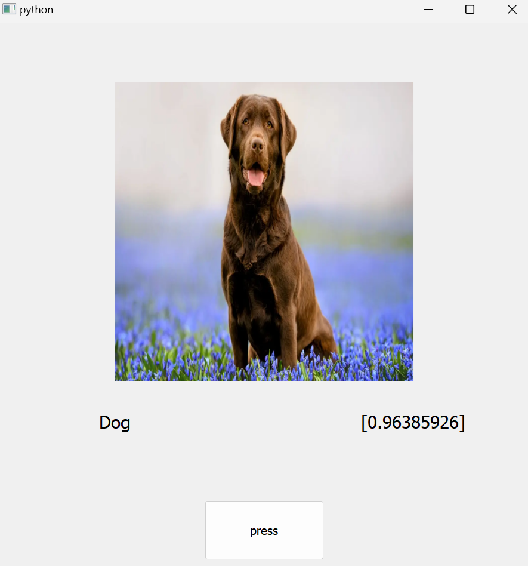

# Dog vs Cat GUI APP Binary Classificator

This is a gui application that classifies whether an animal is a dog or a cat given an image as input. The Application takes an image as an input, it shapes it to 128x128 pixels adding a black padding in case the image is not perfectly squared, then the images is given to a model that outputs the label and the probability associated. The model is a simple neural network composed by:
- 2 Convolutional Layers (filters=16 each)
- 1 MaxPooling Layer
- 2 Convolutional Layers (filters=32 each)
- 1 MaxPooling Layer
- 1 Flatten Layer
- 1 Dense Layer (1024 neurons)
- 1 Dense Layer (1 final output neuron)

    

For further information about the neural network, look at the file *'build.ipynb'* in the folder *building*.

### Dataset
The model was trained using the cats_vs_dogs dataset from **Hugging Face**, explained at the following link <https://huggingface.co/datasets/microsoft/cats_vs_dogs>.

### Requirements:
The project was created using python 3.11.9.
The following are the needed requirements:
- tensorflow
- Pillow
- numpy
- PyQt5
- opencv-python
- datasets
- sklearn

Keep in mind that all these libraries are needed both for creating the model locally and for running the application.For the people who want to keep the packages all in the same place, it is strongly recommended to create a new enviroment using anaconda and install all the packages. 

### How to create the model:
- open the folder 'building' and run the whole 'build.ipynb' file.
- not mandatory: you can test the model by opening the 'testing' folder and running 'test.ipynb'. the folder 'samples' provide you with some inputs. In that case put the input in 'file_path' in the second-last cell of the script.

### How to run the app:
- download a picture of a dog or a cat from the browser (file supported: .png .xpm .jpg .jpeg .bmp webp)
- run the app from 'main.py'
